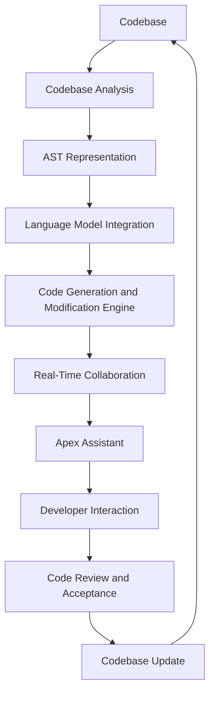
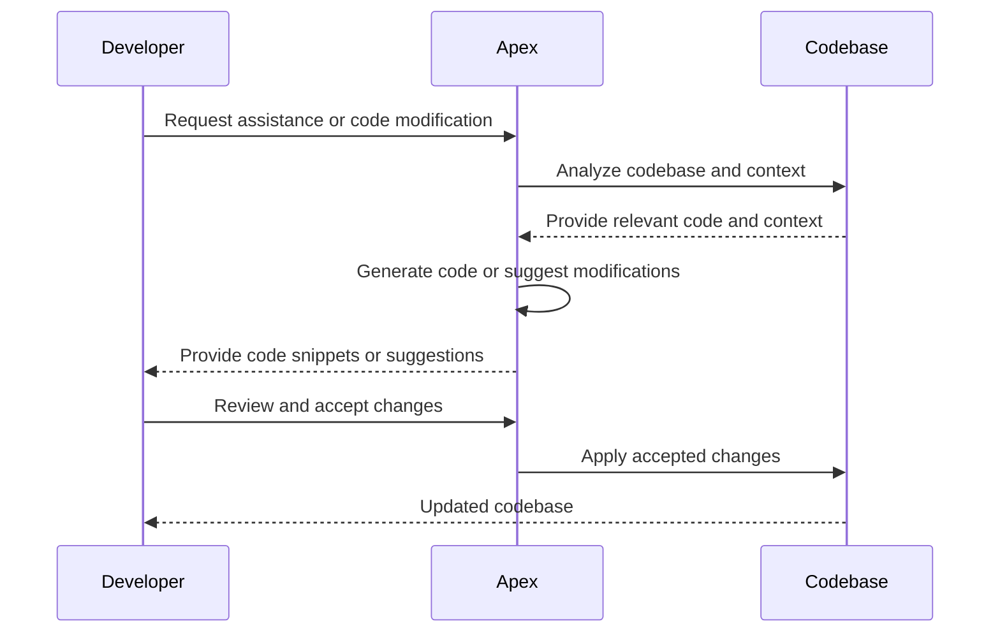
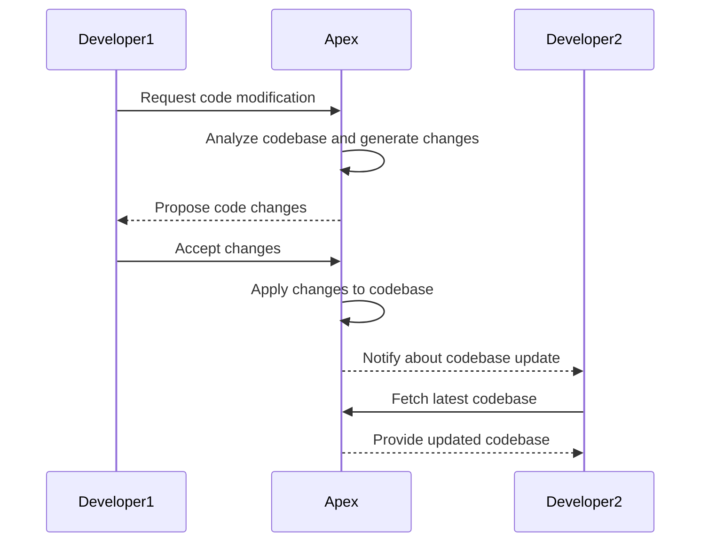

Apex loading...😎
Sure! Let's add more diagrams to visualize the architecture and workflow of Apex. We'll use Mermaid.js to create the diagrams.

## Apex Architecture Diagram

This diagram illustrates the high-level architecture of Apex and the flow of data and interactions between its components. The codebase undergoes analysis to create an AST representation, which is then processed by the language model and code generation engine. The real-time collaboration component facilitates interactions between developers and Apex, leading to code reviews, acceptance, and updates to the codebase.

## Developer Workflow with Apex

This sequence diagram showcases the typical workflow of a developer interacting with Apex. The developer initiates a request for assistance or code modification, which triggers Apex to analyze the codebase and relevant context. Based on the analysis, Apex generates code snippets or suggests modifications. The developer reviews the changes and decides to accept them. Apex then applies the accepted changes to the codebase, and the updated codebase is accessible to the developer.

## Real-Time Collaboration with Apex

This sequence diagram illustrates the real-time collaboration feature of Apex. When Developer1 requests a code modification, Apex analyzes the codebase and generates the necessary changes. The proposed changes are sent back to Developer1 for review and acceptance. Once accepted, Apex applies the changes to the codebase. Developer2, who is collaborating on the same project, receives a notification about the codebase update. Developer2 can then fetch the latest codebase from Apex to stay synchronized with the changes made by Developer1.

These diagrams provide a visual representation of the architecture, workflow, and collaboration aspects of Apex. They help in understanding how Apex interacts with the codebase, developers, and facilitates real-time collaboration among team members.