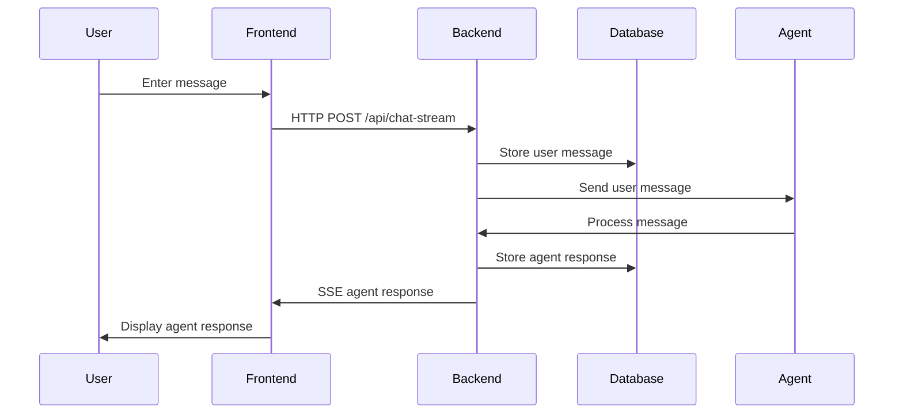
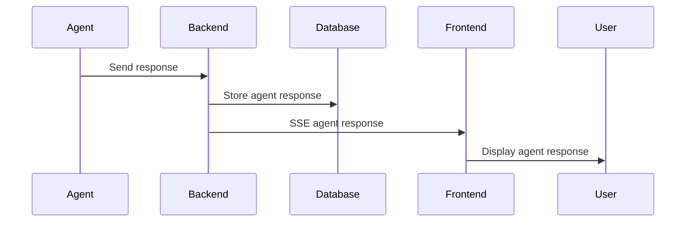
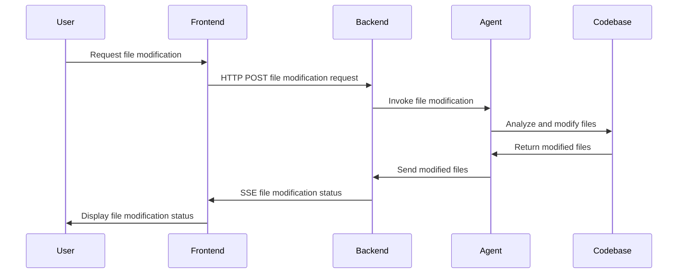

Apex loading...😎
# Software Design and Architecture Document

## Table of Contents
1. [Introduction](#introduction)
2. [System Overview](#system-overview)
3. [Components](#components)
   - [Frontend](#frontend)
   - [Backend](#backend)
   - [Database](#database)
4. [Component Boundaries and Interfaces](#component-boundaries-and-interfaces)
   - [Frontend-Backend Interface](#frontend-backend-interface)
   - [Backend-Database Interface](#backend-database-interface)
5. [Transactions and Data Flow](#transactions-and-data-flow)
   - [User Message Transaction](#user-message-transaction)
   - [Agent Response Transaction](#agent-response-transaction)
   - [File Modification Transaction](#file-modification-transaction)
6. [Sequence Diagrams](#sequence-diagrams)
   - [User Message Sequence](#user-message-sequence)
   - [Agent Response Sequence](#agent-response-sequence)
   - [File Modification Sequence](#file-modification-sequence)
7. [Conclusion](#conclusion)

## Introduction
This document provides an overview of the software design and architecture for the Cognosis-II system. It describes the main components, their boundaries, interfaces, and the transactions that flow through the system.

## System Overview
Cognosis-II is an AI-powered chat application that enables users to interact with intelligent agents for coding assistance and collaborative development. The system consists of three main components: Frontend, Backend, and Database.

## Components

### Frontend
The Frontend component is a React application that provides the user interface for the chat application. It allows users to enter messages, select avatars, and view the conversation history. The Frontend communicates with the Backend using HTTP requests and Server-Sent Events (SSE) for real-time updates.

### Backend
The Backend component is an Express.js server that handles the chat logic, processes user requests, and manages the communication with the language models and agents. It exposes RESTful APIs for the Frontend to interact with and uses SSE to stream real-time updates to the client.

### Database
The Database component is a SQLite database that stores session data, user messages, and agent responses. It provides persistence and allows the system to retrieve historical data and maintain conversation context across sessions.

## Component Boundaries and Interfaces

### Frontend-Backend Interface
The Frontend and Backend components communicate through a well-defined interface using HTTP and SSE protocols. The Frontend sends user messages and requests to the Backend via HTTP POST requests to the `/api/chat-stream` endpoint. The Backend responds with real-time updates using SSE, sending data to the Frontend as events.

### Backend-Database Interface
The Backend interacts with the Database using SQLite queries and commands. It uses the `Database` classes (`SessionTable`, `SessionMessageTable`, `FingerprintTable`, `CompletionTable`) to perform database operations such as creating sessions, storing messages, and retrieving data. The Backend sends SQL queries to the Database and receives the result sets.

## Transactions and Data Flow

### User Message Transaction
1. The user enters a message in the Frontend chat interface.
2. The Frontend sends an HTTP POST request to the Backend's `/api/chat-stream` endpoint, including the user message, session ID, and other relevant data.
3. The Backend receives the request, processes the message, and stores it in the Database.
4. The Backend sends the user message to the appropriate agent for processing.

### Agent Response Transaction
1. The agent processes the user message and generates a response.
2. The agent sends the response back to the Backend.
3. The Backend stores the agent response in the Database.
4. The Backend sends the agent response to the Frontend using SSE.
5. The Frontend receives the SSE event and displays the agent response in the chat interface.

### File Modification Transaction
1. The user requests a file modification through the chat interface (e.g., using the `/w` command).
2. The Frontend sends the file modification request to the Backend via an HTTP POST request.
3. The Backend processes the request and invokes the appropriate agent to handle the file modification.
4. The agent analyzes the codebase, generates the necessary changes, and modifies the specified files.
5. The agent sends the modified files back to the Backend.
6. The Backend sends the file modification status and updates to the Frontend using SSE.
7. The Frontend receives the SSE event and displays the file modification status in the chat interface.

## Sequence Diagrams

### User Message Sequence

### Agent Response Sequence

### File Modification Sequence

## Conclusion
This document provides an overview of the software design and architecture for the Cognosis-II system. It describes the main components (Frontend, Backend, Database), their boundaries, and interfaces. The document also explains the key transactions that flow through the system, including user message, agent response, and file modification transactions. The sequence diagrams illustrate the flow of data and interactions between the components during these transactions.

By understanding the system architecture, component boundaries, and transaction flows, developers can effectively maintain, extend, and scale the Cognosis-II application while ensuring its reliability and performance.