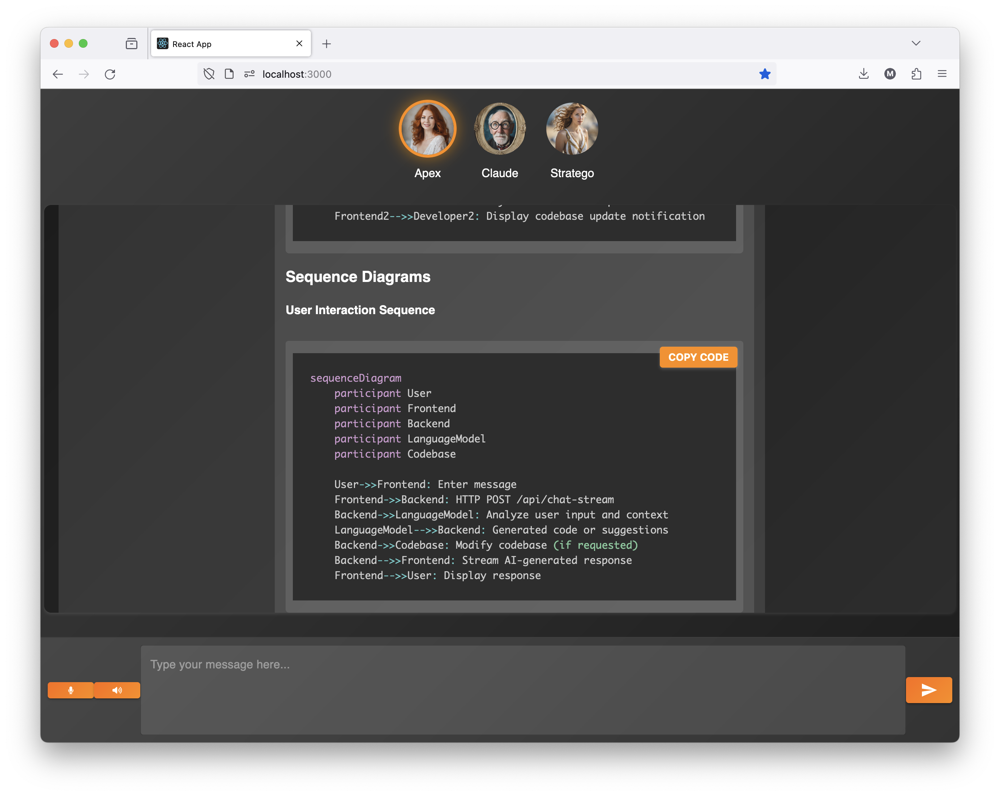

# Cognosis-II



Cognosis-II is a groundbreaking AI-powered chat application that pushes the boundaries of AI-assisted software development. By leveraging state-of-the-art language models and innovative code generation techniques, Cognosis-II introduces a revolutionary approach to building and maintaining software projects.
This was co-developed by Matthew Busigin and Arbaaz Mahmood.
## Apex: The Game-Changing Self-Writing Code Agent
At the heart of Cognosis-II lies Apex, a cutting-edge AI agent that takes code generation to new heights. Apex solves the long-standing "patching problem" in AI-assisted coding, where language models often struggle to generate complete and functional code snippets. With Apex, you can now interact with your codebase using natural language, and watch as it intelligently writes and modifies code files in real-time.
### Solving the Patching Problem
One of the biggest challenges in AI-generated code is the "patching problem" - the inability of language models to generate code that seamlessly integrates with the existing codebase. Apex tackles this issue head-on by employing advanced techniques such as:
- **Codebase Analysis**: Apex deeply analyzes your project's codebase, building a comprehensive understanding of its structure, dependencies, and data flows. This allows Apex to generate code that fits perfectly within the context of your project.
- **Intelligent Code Generation**: Leveraging the power of state-of-the-art language models, Apex generates code snippets that are not only syntactically correct but also semantically meaningful. It takes into account the conversation history, user instructions, and the project's architecture to produce code that aligns with your requirements.
- **Seamless Integration**: Apex ensures that the generated code integrates smoothly with your existing codebase. It handles necessary imports, manages dependencies, and follows the project's coding conventions and best practices.
### Real-Time Code Integration
Cognosis-II takes the AI-assisted coding experience to the next level by enabling real-time code integration. As you interact with Apex through the chat interface, it dynamically modifies and updates your codebase in real-time. This means you can see the code changes happening live, without the need for manual interventions or complex setup processes.
Apex's real-time code integration capabilities include:
- **File Rematerialization**: Apex intelligently rematerializes the affected code files, ensuring that your codebase remains up to date with the latest modifications. It handles file creation, deletion, and updates seamlessly.
- **Instant Feedback**: As Apex generates and integrates code, it provides instant feedback on the changes made. You can see the modified files, review the code diff, and even run tests to verify the functionality of the generated code.
- **Collaborative Development**: Cognosis-II's real-time code integration enables collaborative development like never before. Multiple developers can interact with Apex simultaneously, working on different parts of the codebase, and see the changes reflected in real-time.
### Empowering Developers with AI
Cognosis-II and Apex empower developers to leverage the full potential of AI in their software development workflow. With Apex by your side, you can:
- **Accelerate Development**: Apex helps you write code faster by generating complete and functional code snippets based on your instructions. It takes care of the tedious and repetitive tasks, allowing you to focus on high-level design and problem-solving.
- **Enhance Code Quality**: Apex's intelligent code generation ensures that the produced code follows best practices, is well-structured, and maintainable. It helps you write cleaner and more efficient code, reducing the chances of errors and bugs.
- **Explore New Possibilities**: Apex's ability to understand and modify codebases opens up new possibilities for experimentation and innovation. You can quickly prototype ideas, try out different approaches, and iterate on your designs with the help of AI-generated code.
## Experience the Future of AI-Assisted Coding
Cognosis-II, powered by Apex, represents a significant leap forward in AI-assisted software development. It solves the patching problem, enables real-time code integration, and empowers developers to build software projects faster and more efficiently.
Join us on this exciting journey and experience the future of coding with Cognosis-II. Unleash the power of AI to revolutionize your software development workflow and take your projects to new heights.
Get started with Cognosis-II today and witness the transformative power of AI-assisted coding!
## Prerequisites
To run Cognosis-II, ensure that you have the following installed:
- Node.js (version 14 or higher)
- npm (Node Package Manager)
## Installation
1. Clone the repository:
 ```bash
git clone https://github.com/yourusername/cognosis-ii.git
 ```
2. Navigate to the project directory:
 ```bash
cd cognosis-ii
 ```
3. Install the dependencies for both the backend and frontend:
 ```bash
npm install
cd backend
npm install
cd ../frontend
npm install
 ```
## Configuration
1. Create a `.env` file in the `backend` directory and provide the necessary configuration:
 ```
 API_TOKEN=your_api_token
 ```
 Replace `your_api_token` with your actual API token.
2. Optionally, you can modify the `PORT` constant in `backend/index.ts` to change the port on which the backend server runs (default is 3001).
## Running the Application
1. Start the backend server:
 ```bash
cd backend
npm start
 ```
 The backend server will start running on `http://localhost:3001`.
2. In a separate terminal, start the frontend development server:
 ```bash
cd frontend
npm start
 ```
 The frontend server will start running on `http://localhost:3000`.
3. Open your web browser and visit `http://localhost:3000` to access the Cognosis-II chat application.
## Architecture Overview
Cognosis-II follows a client-server architecture, with the backend server handling chat logic, language model communication, and session management using SQLite. The frontend, built with React, communicates with the backend via HTTP requests and SSE for real-time updates.
The backend server is designed with extensibility in mind, allowing seamless integration of custom query planners and agents. The main components of the backend include:
- `Session`: Represents a chat session, manages conversation context and messages, and provides an interface for interacting with language models.
- `Agent`: An abstract base class for implementing custom agents that process user queries and generate responses.
- `QueryPlanner`: An abstract base class for implementing query planners that generate plans to solve user queries.
- `Database`: Provides an interface for interacting with the SQLite database to store and retrieve session data and messages.
The frontend is composed of several key components:
- `App`: The main component that serves as the entry point for the application. It manages the overall state and functionality of the chat interface.
- `ChatWindow`: Renders the chat messages and handles the display of user and assistant messages.
- `AvatarSelector`: Allows users to select an avatar for their chat session.
- `PreferencesPopup`: Enables users to set their preferences, such as theme and language.
## Writing Custom Agents
Cognosis-II allows you to write custom agents to handle specific tasks or domains. To create a new agent, follow these steps:
1. Create a new TypeScript file in the `backend/agents` directory, e.g., `my-agent.ts`.
2. Define a new class that extends the `Agent` abstract base class:
 ```typescript
import { Session } from "../session";
import { Agent } from "./agent";
export class MyAgent extends Agent {
public async run(session: Session): Promise<void> {
// Implement the agent's logic here
 }
}
 ```
3. Implement the `run` method to define the agent's behavior. The `session` parameter provides access to the current chat session, allowing you to retrieve user messages, send responses, and interact with language models.
4. Use the `session.llm` method to send messages to the language model and receive generated responses. Customize the parameters such as `temperature` and `max_tokens` to control the generation process.
5. Use the `session.send` method to send responses back to the client in real-time using SSE.
6. Register your custom agent in the `backend/index.ts` file by importing it and adding it to the list of available agents.
## APIs and Endpoints
Cognosis-II exposes several APIs and endpoints for interacting with the application:
- `/api/chat-stream`: Initiates a chat session and streams AI-generated responses in real-time using SSE.
- `/api/messages`: Retrieves the chat history for a specific session.
- `/api/audio`: Accepts audio files for transcription using the OpenAI Whisper API.
For detailed information on request/response formats and authentication requirements, please refer to the API documentation.
## Data Persistence
Cognosis-II uses SQLite to persist session data and messages. The `Database` classes in the `backend/Database.ts` file provide an interface for interacting with the SQLite database. The main tables used for data storage are:
- `sessions`: Stores information about chat sessions, including session ID and associated avatar.
- `session_messages`: Stores the messages exchanged within each chat session, including the message role (user or assistant) and content.
The `Session` class in `backend/session.ts` provides methods for loading and saving session data and messages to the database.
## Contributing
Contributions to Cognosis-II are welcome! If you encounter any issues or have suggestions for improvements, please open an issue or submit a pull request on the GitHub repository.
To contribute to the project, please follow these guidelines:
1. Fork the repository and create a new branch for your feature or bug fix.
2. Ensure that your code adheres to the project's coding style and conventions.
3. Write clear and concise commit messages explaining your changes.
4. Submit a pull request to the main repository, describing your changes and their benefits.
## Future Enhancements
Here are some potential enhancements and features planned for Cognosis-II:
- 🌐 Multilingual support for chat interactions
- 🎨 Customizable chat themes and avatars
- 📊 Analytics and insights on chat sessions and user engagement
- 🔒 Enhanced security measures and user authentication
- 🤝 Integration with external services and APIs
If you have any ideas or suggestions for future enhancements, please feel free to open an issue or contribute to the project.
## License
This project is licensed under the MIT License.
---
🚀 Experience the future of AI-assisted coding with Cognosis-II! Harness the power of advanced language models, real-time code integration, and seamless collaboration to revolutionize your software development workflow. Start building intelligent, context-aware applications today! 🌟


You can reach out to the maintainter and authors via their twitter:


#Matt Busigin
https://twitter.com/mbusigin


#Arbaaz Mahmood
https://twitter.com/hingumtringum
